# Designing an SMTP Mail Server Using iRedMail (Ubuntu + VPS)

## 📌 Overview
In this lab, I designed and deployed a fully working **SMTP mail server** using **iRedMail** on a cloud VPS. I configured the domain, DNS records, reverse DNS, TLS (Let’s Encrypt), and mail authentication (SPF/DKIM/DMARC), and then validated real email delivery by sending messages to external recipients and receiving replies.

This README is written as a **step-by-step setup guide** with **real screenshots from my lab**.

---

## ✅ What I built in this lab
- A working mail server for the domain: **vibinsec.live**
- Mail hostname (FQDN): **mail.vibinsec.live**
- Web interfaces:
  - **Roundcube webmail**
  - **iRedAdmin admin panel**
- Security hardening essentials:
  - TLS certificate from **Let’s Encrypt**
  - DNS authentication: **SPF, DKIM, DMARC**
  - **Reverse DNS (PTR)** configured on the VPS provider side
- Verified end-to-end email flow:
  - Sent mail out to Gmail / external users
  - Received replies back successfully

---

## 🧠 Prerequisites (before starting)
You need:
- A domain name (I used Namecheap)
- A cloud VPS with a **public IPv4** (and optionally IPv6)
- Port access open (at minimum):
  - **25** (SMTP)
  - **587** (Submission)
  - **993** (IMAPS)
  - **80/443** (webmail + TLS issuance)
- Root SSH access to the VPS

---

## 1) Provision the VPS
I purchased/provisioned the VPS first (Contabo). Once provisioning finished, I noted the assigned public IP address which I later used in DNS records.

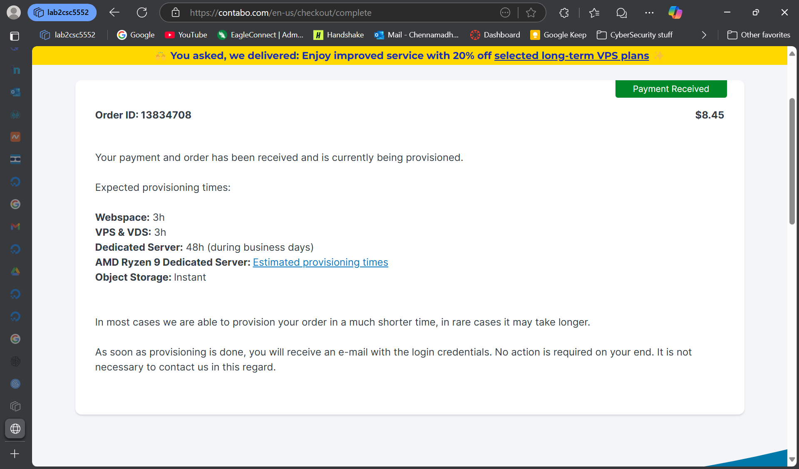

---

## 2) Set a proper hostname (FQDN)
Mail servers must use a clean hostname that matches DNS and reverse DNS.

### ✅ Target hostname used in this lab
- **mail.vibinsec.live**

I verified the current hostname and then changed it to the mail FQDN.

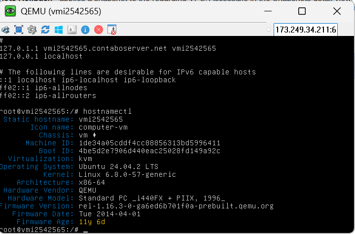

---

## 3) Update `/etc/hosts`
To avoid local hostname resolution issues, I updated `/etc/hosts` so the server maps its IP to hostname.

Example (what matters is the pattern):
- `IP  domain  mail`

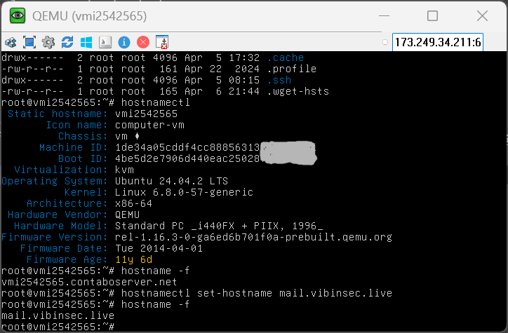

---

## 4) Configure DNS records in Namecheap
After hostname setup, I configured DNS so the domain points correctly to the VPS.

### 4.1 Add A Record
I created an **A record** for `mail` pointing to the server IP.

- Host: `mail`
- Value: `173.249.31.162`

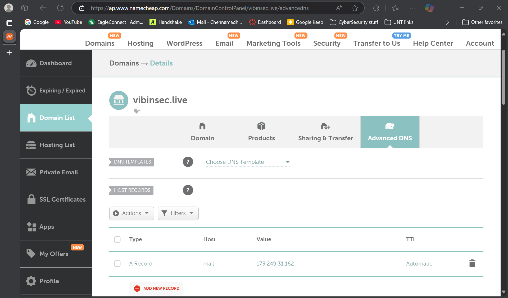

### 4.2 Add MX Record
I created an **MX record** to tell the internet where mail for the domain should be delivered.

- Host: `@`
- Value: `mail.vibinsec.live`
- Priority: `10`

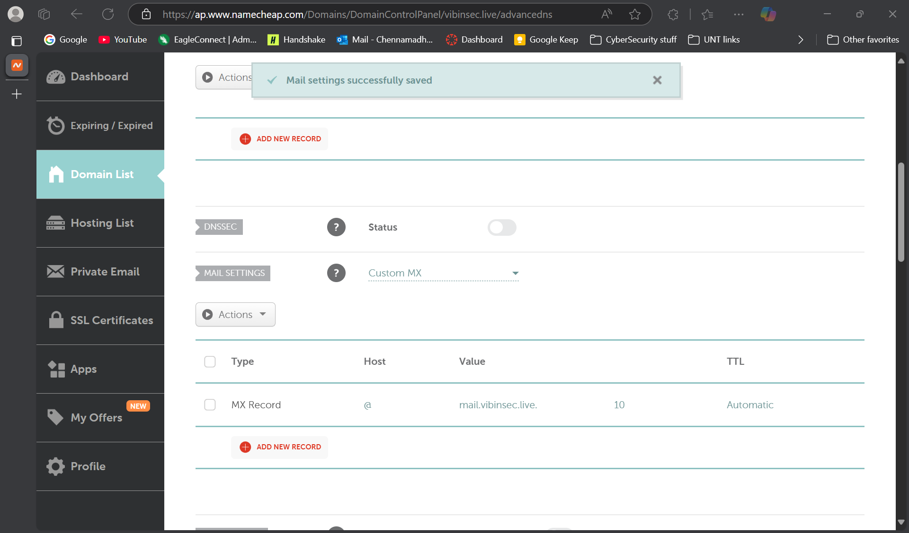

---

## 5) Configure Reverse DNS (PTR)
Reverse DNS is extremely important for deliverability. Many providers mark mail as spam if PTR is missing or incorrect.

I configured PTR in the VPS provider panel so the server IP points back to:

- `mail.vibinsec.live`

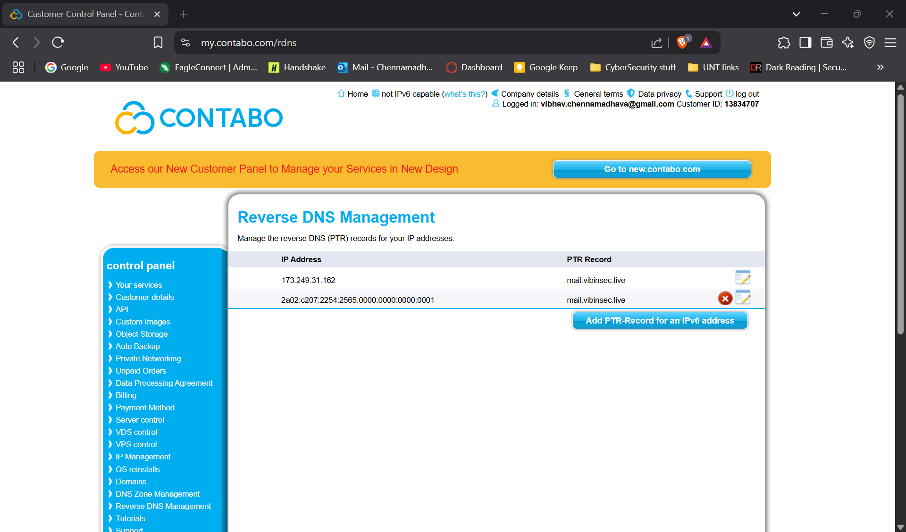

---

## 6) Install iRedMail
Next, I installed iRedMail on the VPS. iRedMail installs and configures:
- Postfix (SMTP)
- Dovecot (IMAP/POP)
- Roundcube (webmail)
- iRedAdmin (admin panel)
- Anti-spam and supporting components (depending on selection)

### 6.1 Choose storage backend
In the installer, I selected the backend used for mail accounts. (In my lab, LDAP option was selected.)

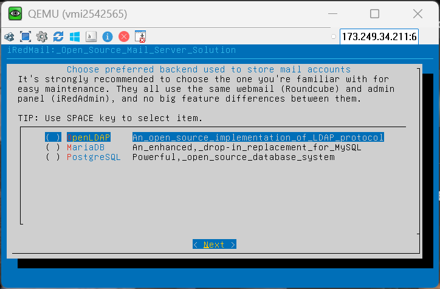

### 6.2 Choose Web Server
I selected **Nginx** as the preferred web server.

### 6.3 Set the first mail domain
When asked for the first mail domain, I entered:

- `vibinsec.live`

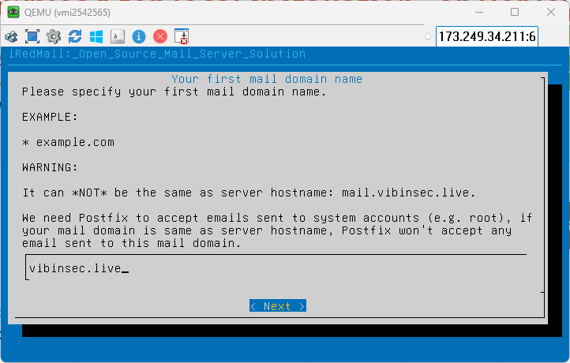

### 6.4 Set admin password
Then I set the password for the mail domain admin:
- `postmaster@vibinsec.live`

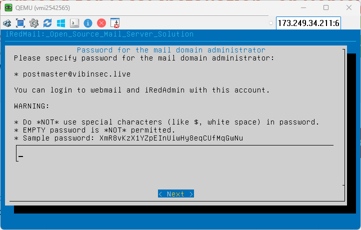

### 6.5 Select optional components
I kept useful defaults enabled such as:
- Roundcube webmail
- iRedAdmin
- Fail2ban (basic brute-force protection)

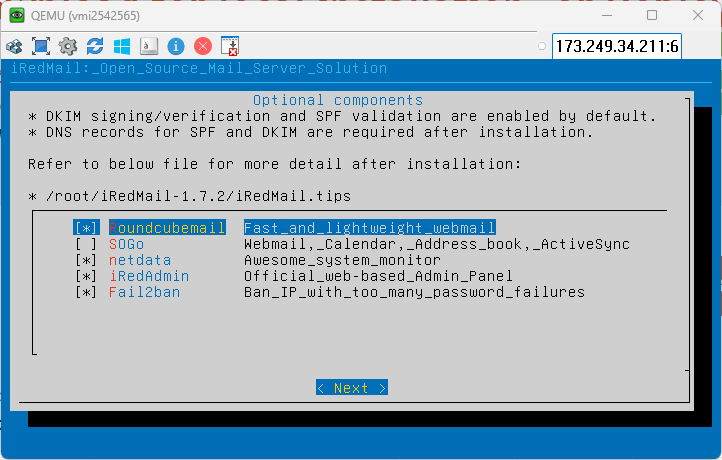

### 6.6 Installation completed
Once the installer finished, iRedMail displayed the access URLs and credentials.

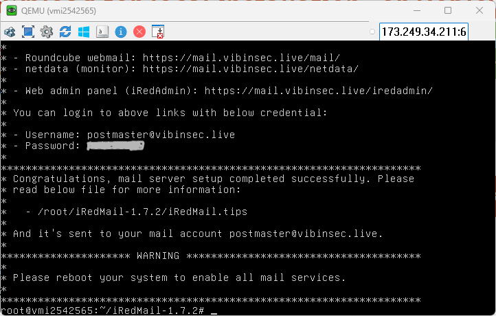

---
Amavisd show keys reaveals th DKIM.domain key

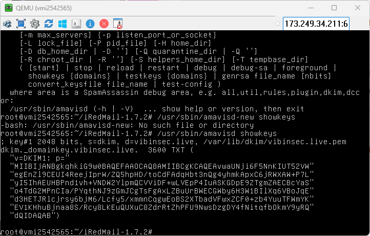

## 7) Verify iRedAdmin dashboard
After installation, I confirmed the admin panel was reachable and shows correct server/domain info.

- URL: `https://mail.vibinsec.live/iredadmin`

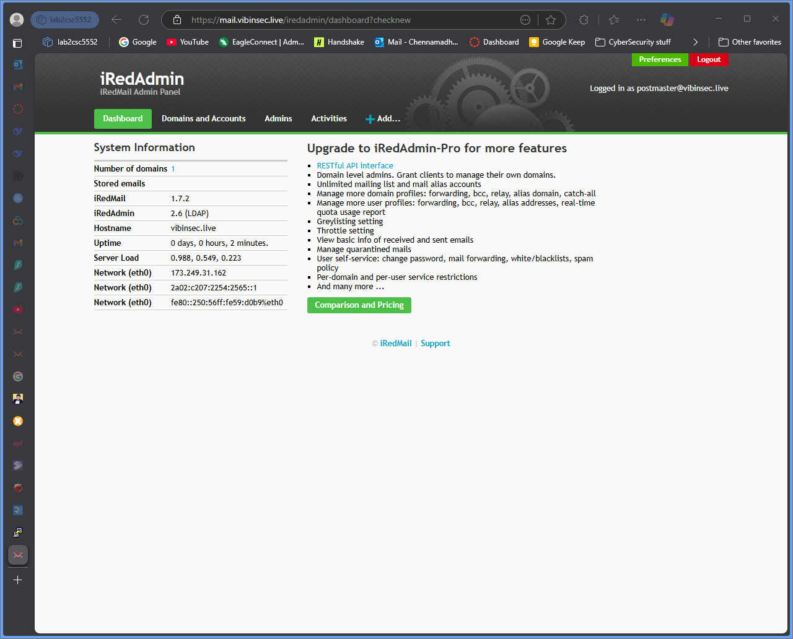

---

## 8) Install TLS certificate (Let’s Encrypt using Certbot)
For secure mail and secure web access, TLS is required. I used Let’s Encrypt.

### 8.1 Install certbot
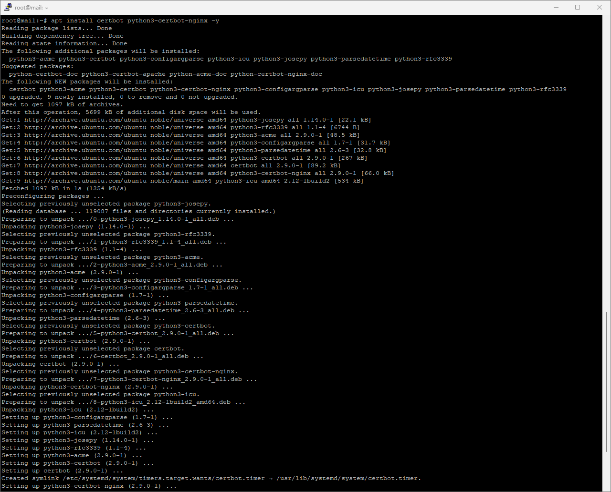

### 8.2 Request certificate for the mail hostname
I generated the certificate for:
- `mail.vibinsec.live`

The certificate was saved under:
- `/etc/letsencrypt/live/mail.vibinsec.live/`

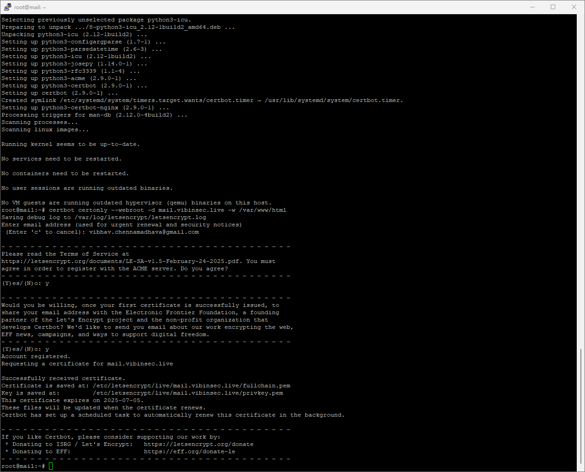

---

## 9) Point mail services to the Let’s Encrypt certificate
After cert generation, I updated service configurations to use the new cert paths.

### 9.1 Update Postfix (SMTP TLS)
I updated `/etc/postfix/main.cf` so Postfix uses the Let’s Encrypt cert:

- `smtpd_tls_key_file`
- `smtpd_tls_cert_file`
- `smtpd_tls_CAfile`

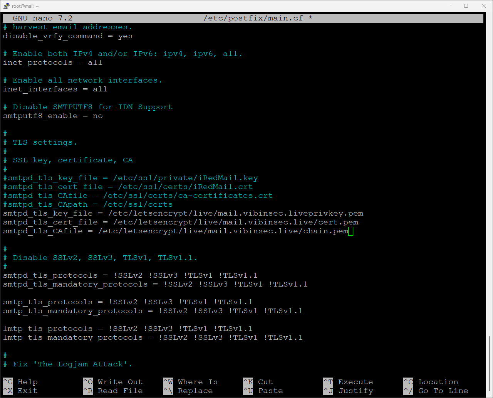

### 9.2 Update Dovecot (IMAP TLS)
I updated `/etc/dovecot/dovecot.conf` so Dovecot uses:

- `ssl_cert = </etc/letsencrypt/live/mail.vibinsec.live/fullchain.pem`
- `ssl_key  = </etc/letsencrypt/live/mail.vibinsec.live/privkey.pem`

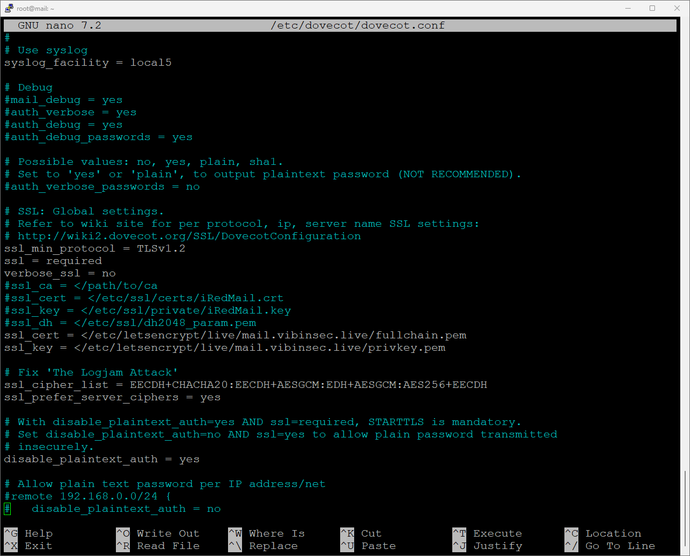

### 9.3 Update Nginx SSL template (webmail + admin panel)
I updated the iRedMail Nginx SSL template to use the Let’s Encrypt certificate.

---
Restarting all services

## 10) Configure DKIM (mail signing) and capture DKIM key
DKIM helps prevent spoofing and improves delivery by signing outgoing emails.

I extracted the DKIM public key output and added it as a DNS TXT record.

Then I added it in Namecheap as a TXT record (DKIM selector record).

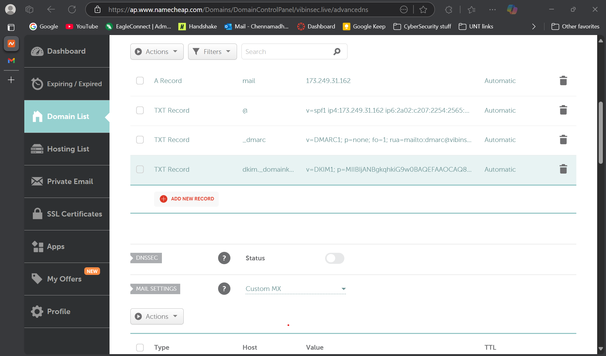

---

## 11) Configure SPF + DMARC DNS records
### 11.1 SPF (Sender Policy Framework)
SPF tells receivers which IPs are allowed to send mail for your domain.

### 11.2 DMARC
DMARC adds policy + reporting on top of SPF/DKIM.

Generating and adding SPF and Dmarc record
Created **SPF record** which essentially prevents unauthorized servers from sending mail as our domain
**dmarc record**  for  policy enforcement and reporting, giving domain owners control over unauthenticated mail and visibility into who's sending mail using our domain. 

Both have,
- Type: `TXT`

For SPF
- Host: `@`
- Value: `v=spf1 ip4:173.249.31.162 ip6:2a02:c207:2254:2565 :...`

For dmarc
- Host: `_dmarc`
- Value: `v=DMARC1; p=none; fo=1; rua=mailto:dmarc@vibins...`

I added the SPF and DMARC TXT records in namecheap domains dashboard

---

## 12) Restart services after configuration changes
After updating TLS and mail settings, I restarted key services:

- nginx
- postfix
- dovecot

---

## 13) Validate MX and mail routing
I confirmed mail routing is correct by checking that:
- MX points to mail.vibinsec.live
- mail.vibinsec.live resolves to the VPS IP (A record)
- PTR resolves back to mail.vibinsec.live

(These steps directly affect deliverability and whether Gmail trusts the server.)

---

## 14) End-to-end Email Testing (real proof)
This is the most important part: proving the server can send mail out and receive replies.

### 14.1 Send a test email from Roundcube
I sent test emails using the webmail interface.

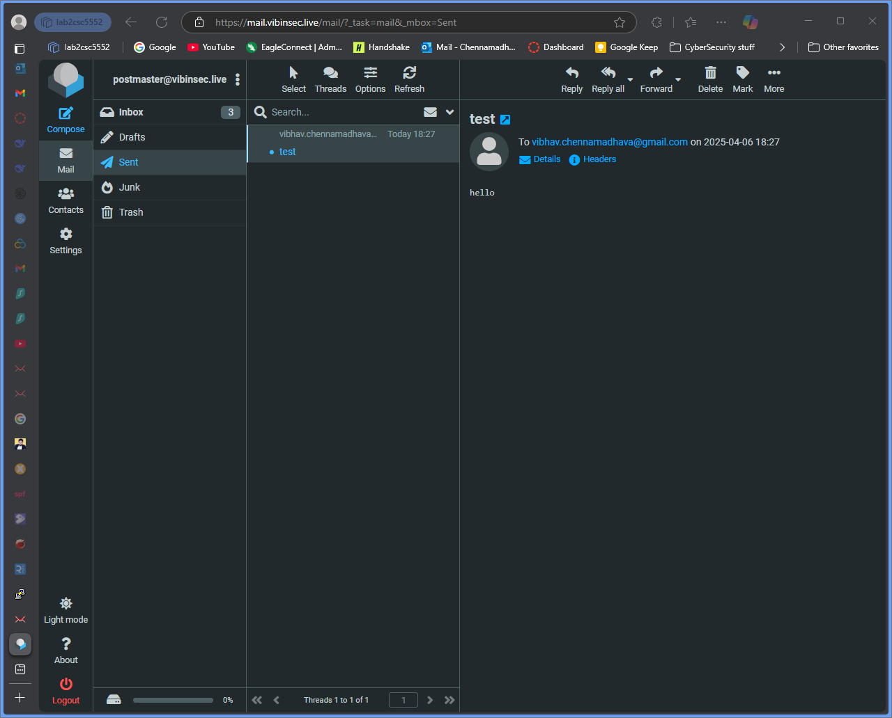

### 14.2 Email delivered externally (Gmail / recipients)
I verified the email arrived externally (one test landed in Spam initially, which is common until reputation builds and DNS auth fully propagates).

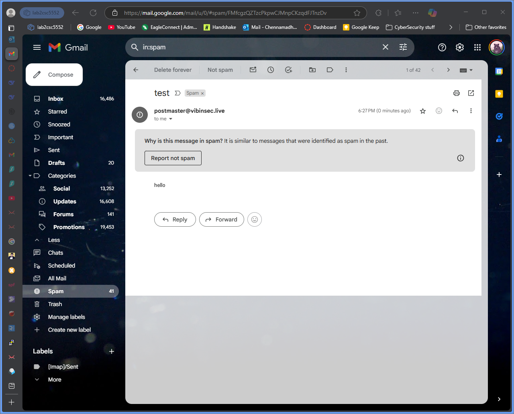

### 14.3 Sent lab email to external user
I sent a proper lab email as confirmation.

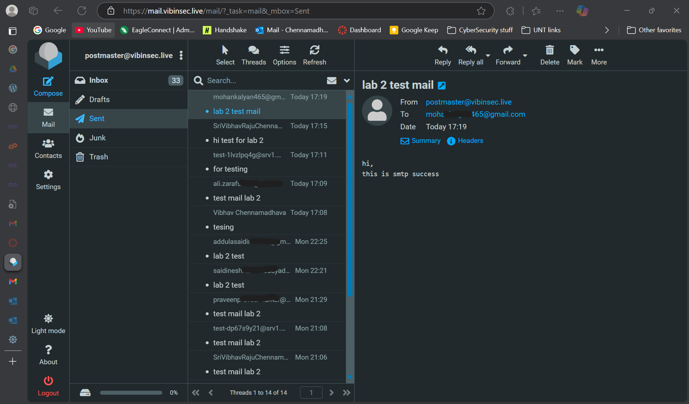

Finally, I received a reply back to my server inbox — confirming full send/receive loop is working.

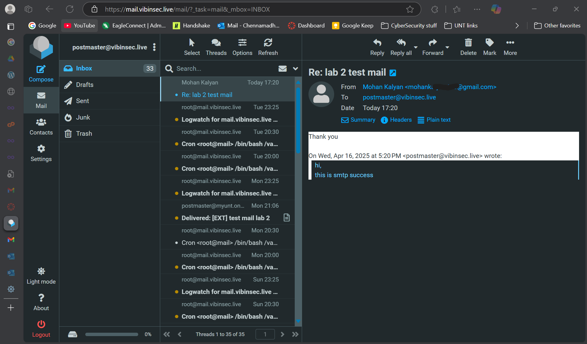

---

## 🧾 Summary what we actually did till now:
I deployed a real SMTP mail server using iRedMail on a VPS and connected it to my custom domain. I configured DNS (A + MX), set reverse DNS (PTR), enabled TLS using Let’s Encrypt, and added SPF/DKIM/DMARC records to improve trust and deliverability. After applying certificate paths in Postfix, Dovecot, and Nginx, I restarted services and verified that outgoing messages reach external providers and incoming replies are received correctly. This lab gave me hands-on understanding of real mail server architecture and the security controls used to prevent spoofing and improve email reputation.

---

## 📝 Notes I learned (practical takeaways)
- **Reverse DNS (PTR)** is a huge factor for deliverability.
- **SPF + DKIM + DMARC** are basically mandatory if you want your mails to avoid spam.
- Even with everything correct, new domains/IPs can still land in spam initially because reputation takes time.
- TLS must be configured for **SMTP + IMAP + Web interfaces**, not only the website.
- After cert renewals, it’s smart to ensure Postfix/Dovecot continue referencing the correct symlink paths in `/etc/letsencrypt/live/...`.

---
